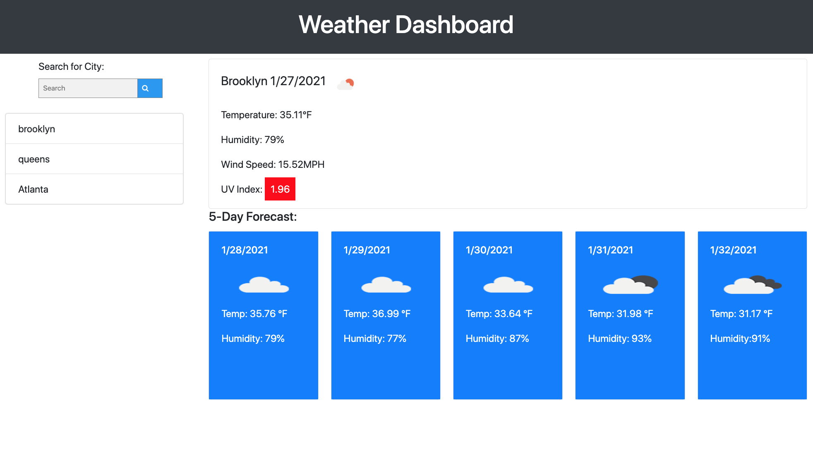

Server-Side APIs Weather Dashboard

Production page: https://janesferr.github.io/Weather-Map/

## This repo contains:
* A jQuery dyanmic web app that allows you to search the current weather and multiple data points such as temperature, humidity, wind speed, and UV index, as well as a 5 day forecast.
* A vanilla css stylesheet, and the jQuery file script.js
* The button history on the side of the screen allows you to populate your searches as well as click and choose the old weather searches that you have searched for.
* Using the APIs from https://openweathermap.org/api , I was able to populate the information such as temperature, humidity, wind speed, UV index, and a 5 day forecast.  
* Using the longitude and latitude of a certain city, I was able to populate the UV index for each city. 

